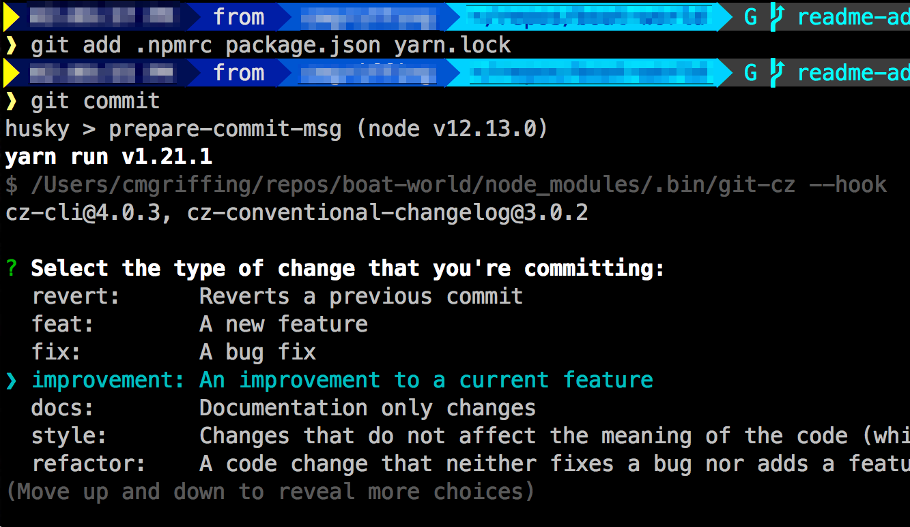

# Boat.World

Bot.Land is a mobile and browser based game that uses automation scripts to manage units on a battlefield. We have permission from the owner to start a community project to create an alternate marketing landing page. As such, we have decided to name the project Boat.World to avoid any SEO collisions.

### Goals of the Project

- **Have Fun!!!!**
- Create a community based project with a goal
- Allow members of the twitch programming community to become familiar with Github workflow
- Help users get involved in Open Source web development

### Do Not Review On Stream

If you are feeling self conscious and would prefer not to have your PR reviewed directly on stream, make sure that you have the first sentence of the PR message read:

**DO NOT REVIEW ON STREAM**

## WARNING: Public Information

Be warned that interacting with Github and Twitch together can reveal who you are more than you intended. If you wish to maintain anonymity, it might be worth it to create a "clean" account on either service.

### Community Project Warning

This project is meant to be a learning process for various members of the Twitch programming community. By contributing to this project you adhere to the LICENSE below and your contributions are open source as well.

## Use Yarn

This project uses Yarn. The reason is that the Gatsby core project does as well and it is usually easiest to stick with the tools that your tools use.

## Formatted Commit Messages

We use [Commitizen](http://commitizen.github.io/cz-cli/) to format commit messages. This allows us to automatically increment the semver version and generate a changelog.

_Make sure you `yarn` to install the dependencies before commiting._

Your PR will be declined if it does not match the commit formatting provided.

# The MIT License (MIT)

Copyright © 2020 Boat.World

Permission is hereby granted, free of charge, to any person
obtaining a copy of this software and associated documentation
files (the “Software”), to deal in the Software without
restriction, including without limitation the rights to use,
copy, modify, merge, publish, distribute, sublicense, and/or sell
copies of the Software, and to permit persons to whom the
Software is furnished to do so, subject to the following
conditions:

The above copyright notice and this permission notice shall be
included in all copies or substantial portions of the Software.

THE SOFTWARE IS PROVIDED “AS IS”, WITHOUT WARRANTY OF ANY KIND,
EXPRESS OR IMPLIED, INCLUDING BUT NOT LIMITED TO THE WARRANTIES
OF MERCHANTABILITY, FITNESS FOR A PARTICULAR PURPOSE AND
NONINFRINGEMENT. IN NO EVENT SHALL THE AUTHORS OR COPYRIGHT
HOLDERS BE LIABLE FOR ANY CLAIM, DAMAGES OR OTHER LIABILITY,
WHETHER IN AN ACTION OF CONTRACT, TORT OR OTHERWISE, ARISING
FROM, OUT OF OR IN CONNECTION WITH THE SOFTWARE OR THE USE OR
OTHER DEALINGS IN THE SOFTWARE.
